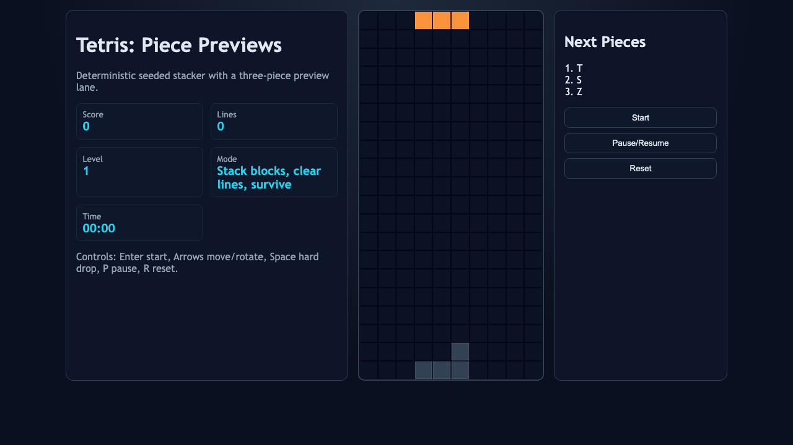
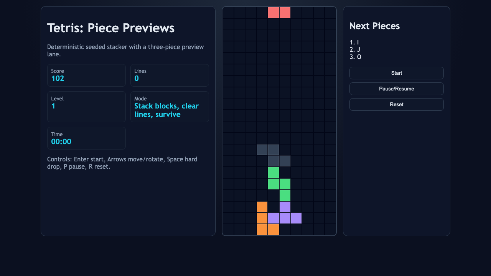
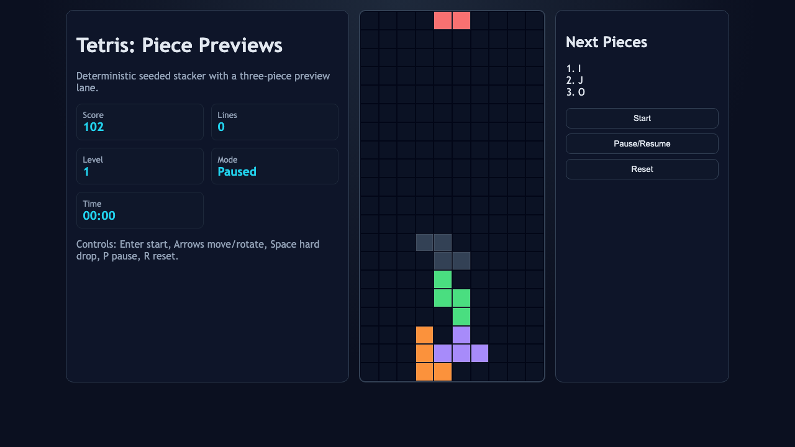

# daily-classic-game-2026-04-10-tetris-piece-previews

<div align="center">
  <h2>Deterministic Tetris with a Three-Piece Preview Twist</h2>
  <p>Classic stacking loop, seeded 7-bag randomizer, pause/reset controls, and automation-friendly browser hooks.</p>
</div>

<div align="center">
  
  
  
</div>

## GIF Captures
- `Opening Preview Lane`: `artifacts/playwright/clip-opening-preview-lane.gif`
- `Hard Drop Stack`: `artifacts/playwright/clip-hard-drop-stack.gif`
- `Pause Reset Cycle`: `artifacts/playwright/clip-pause-reset-cycle.gif`

## Quick Start
```bash
pnpm install
pnpm test
pnpm build
pnpm capture
```

## How To Play
- Press `Enter` or click `Start` to begin.
- Move with `ArrowLeft` and `ArrowRight`.
- Rotate with `ArrowUp`.
- Use `ArrowDown` for soft drop and `Space` for hard drop.
- Press `P` to pause/resume and `R` to reset.

## Rules
- Pieces spawn from a seeded 7-bag generator.
- A piece locks when it can no longer move down.
- Full horizontal lines clear instantly.
- Game ends if a new piece collides at spawn.

## Scoring
- Soft drop: `+1` per row.
- Hard drop: `+2` per row.
- Line clears: `100/300/500/800 * level` for 1/2/3/4 lines.

## Twist
- `Piece previews`: the next three tetrominoes are always visible for planning.

## Verification
- `pnpm test` validates deterministic core logic.
- `pnpm capture` records Playwright screenshots and action payload artifacts.
- Browser hooks:
  - `window.advanceTime(ms)`
  - `window.render_game_to_text()`

## Project Layout
- `src/` game logic and renderer
- `tests/` deterministic unit and Playwright capture tests
- `artifacts/playwright/` screenshots, action JSON, and GIF placeholders
- `docs/plans/` implementation plan
- `assets/` static files
